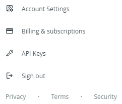

# Arduino iot-api Python client

## Requirements

* Python 3.10+

## Installation

You can install the package directly from Github (you may need to run `pip` with
`sudo`):

```sh
pip install arduino-iot-client
```

## Getting Started

### Authentication

The client requires a valid access token, you can use `requests-oauthlib` to get
one, to install the library do:

```sh
pip install requests-oauthlib
```

After installing the library you can use this Python code to get a token:

```python
from oauthlib.oauth2 import BackendApplicationClient
from requests_oauthlib import OAuth2Session

oauth_client = BackendApplicationClient(client_id=YOUR_CLIENT_ID)
token_url = "https://api2.arduino.cc/iot/v1/clients/token"

oauth = OAuth2Session(client=oauth_client)
token = oauth.fetch_token(
    token_url=token_url,
    client_id=YOUR_CLIENT_ID,
    client_secret=YOUR_CLIENT_SECRET,
    include_client_id=True,
    audience="https://api2.arduino.cc/iot"
)

print(token.get("access_token"))
```

In case of organization access, you can add organization identifier specifying required header:


```python

org_id="<org-id>"

token = oauth.fetch_token(
    token_url=token_url,
    client_id=YOUR_CLIENT_ID,
    client_secret=YOUR_CLIENT_SECRET,
    include_client_id=True,
    audience="https://api2.arduino.cc/iot",
    headers={"X-Organization":org_id}
)

print(token.get("access_token"))
```

Once you get a token, you can create an instance of the iot-api client:

```python
import iot_api_client as iot
from iot_api_client.exceptions import ApiException
from iot_api_client.models import *
from iot_api_client.configuration import Configuration
from iot_api_client.api import DevicesV2Api

# configure and instance the API client
client_config = Configuration(host="https://api2.arduino.cc")
client_config.access_token = YOUR_ACCESS_TOKEN or token function
client = iot.ApiClient(client_config)

# as an example, interact with the devices API
devices_api = deviceApi.DevicesV2Api(client)

client_config = Configuration(host="https://api2.arduino.cc")
client_config.access_token = access_token
client = iot.ApiClient(client_config)

try:
    api_instance = DevicesV2Api(client)
    api_response = api_instance.devices_v2_list()
    for device in api_response:
        print(device.name)
        print(device.type)

except ApiException as e:
    print("Exception when calling DevicesV2Api->devices_v2_list: %s\n" % e)
```

In case of organization access, you can specify organization identifier in this way:

```python
client = iot.ApiClient(client_config,header_name="X-Organization",header_value=org_id)
# or you can specify at method level, like:
api_instance.devices_v2_list(x_organization="org_id")
```

For a working example, see [the example folder](https://github.com/arduino/iot-client-py/tree/master/example/main.py) in this repo.

## How to get Arduino IoT Cloud Client Credentials

You can generate Arduino IoT Cloud Client Credentials in `API Keys` section in the [IoT Cloud](https://app.arduino.cc/api-keys):

### Step 1



### Step 2


### Step 3


